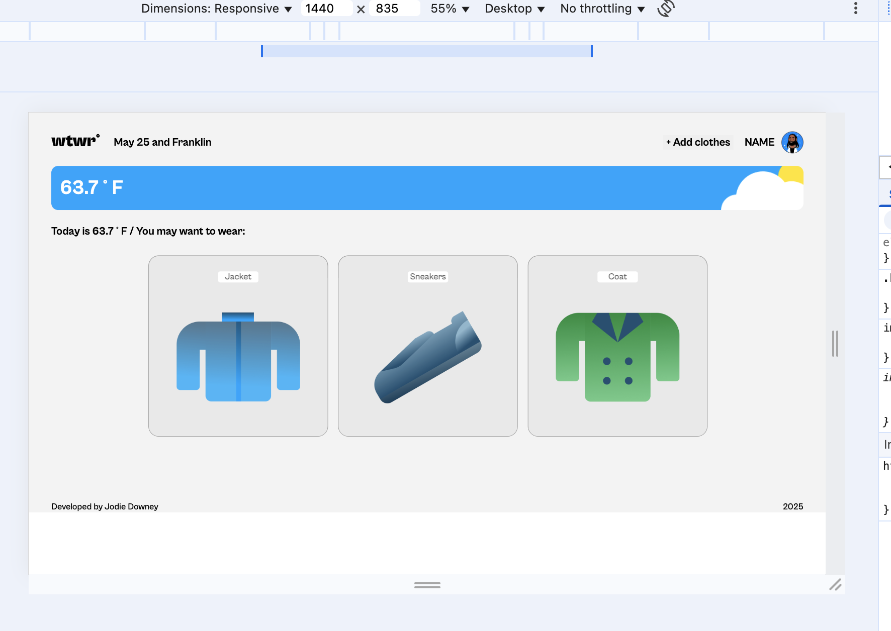
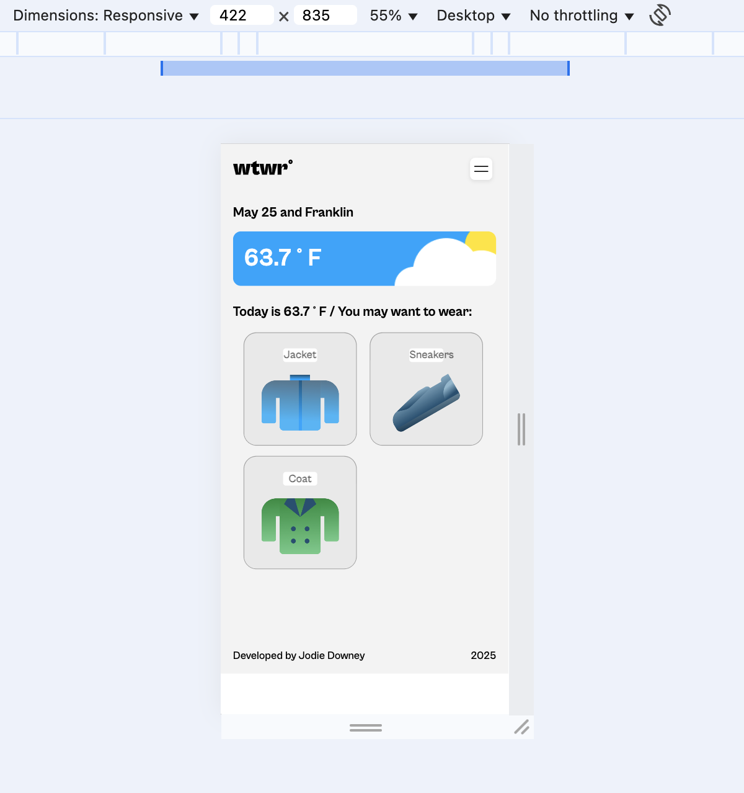
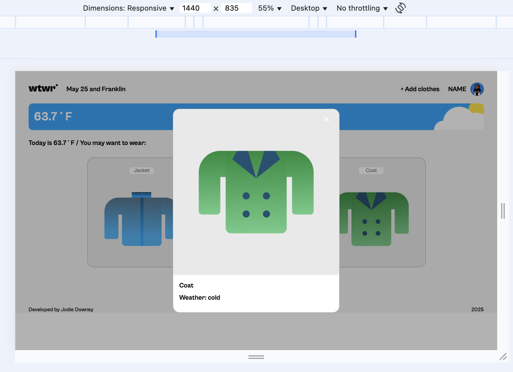
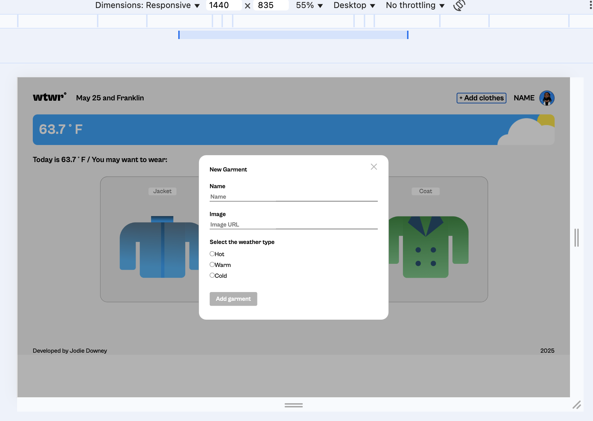

# WTWR (What to Wear)

WTWR is a responsive, single-page React application that provides users with clothes recommendations based on the current weather in their location. The app integrates real-time weather data and allows users to manage their wardrobe by adding or removing clothes items.

## 🚀 Live Demo

Explore the live application here: [WTWR Live](https://jodie-downey.github.io/se_project_react/)

## 🧰 Technologies Used

- **React**: Utilized for building a dynamic and responsive user interface with component-based architecture.
- **Vite**: Employed as the build tool for fast and efficient development.
- **CSS3**: Implemented for styling, ensuring a responsive and visually appealing design.
- **JavaScript (ES6+)**: Used for handling application logic and asynchronous operations.
- **OpenWeatherMap API**: Integrated to fetch real-time weather data based on user location.

## 🖼️ Features

- **Weather-Based Recommendations**: Displays clothes suggestions tailored to the current weather conditions.
- **User Wardrobe Management**: Allows users to add, view, and remove clothes items from their virtual wardrobe.
- **Responsive Design**: Ensures optimal viewing experience across various devices and screen sizes.
- **Form Validation**: Implements client-side validation to ensure accurate and complete user input.

## 🛠️ Project Structure

The application follows a modular structure:

- `public/`: Contains static assets and the `index.html` file.
- `src/`: Houses the main application code, including:
  - `components/`: Reusable React components.
  - `utils/`: Utility functions and API calls.
  - `App.jsx`: Root component managing routes and global state.
  - `index.js`: Entry point rendering the React application.

## Photos

Currently, two official plugins are available:

- [@vitejs/plugin-react](https://github.com/vitejs/vite-plugin-react/blob/main/packages/plugin-react/README.md) uses [Babel](https://babeljs.io/) for Fast Refresh
- [@vitejs/plugin-react-swc](https://github.com/vitejs/vite-plugin-react-swc) uses [SWC](https://swc.rs/) for Fast Refresh
